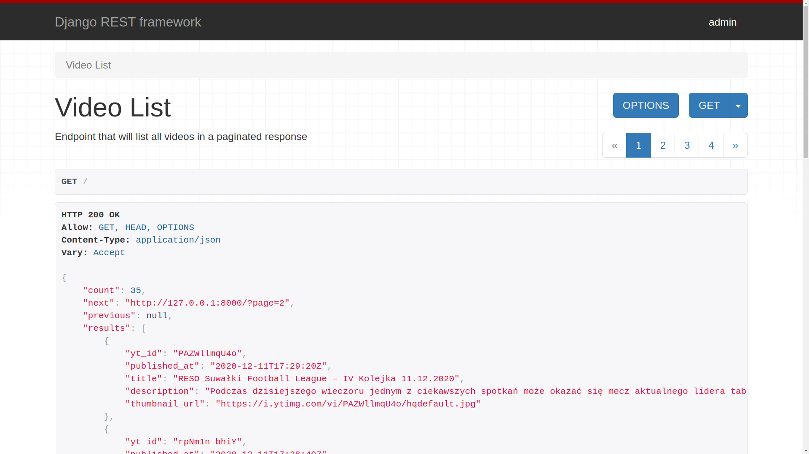
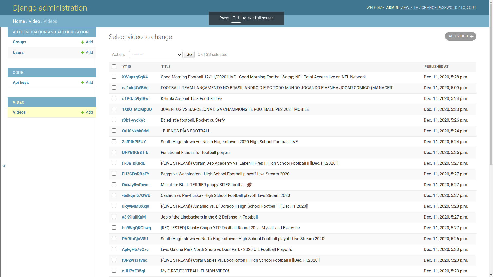
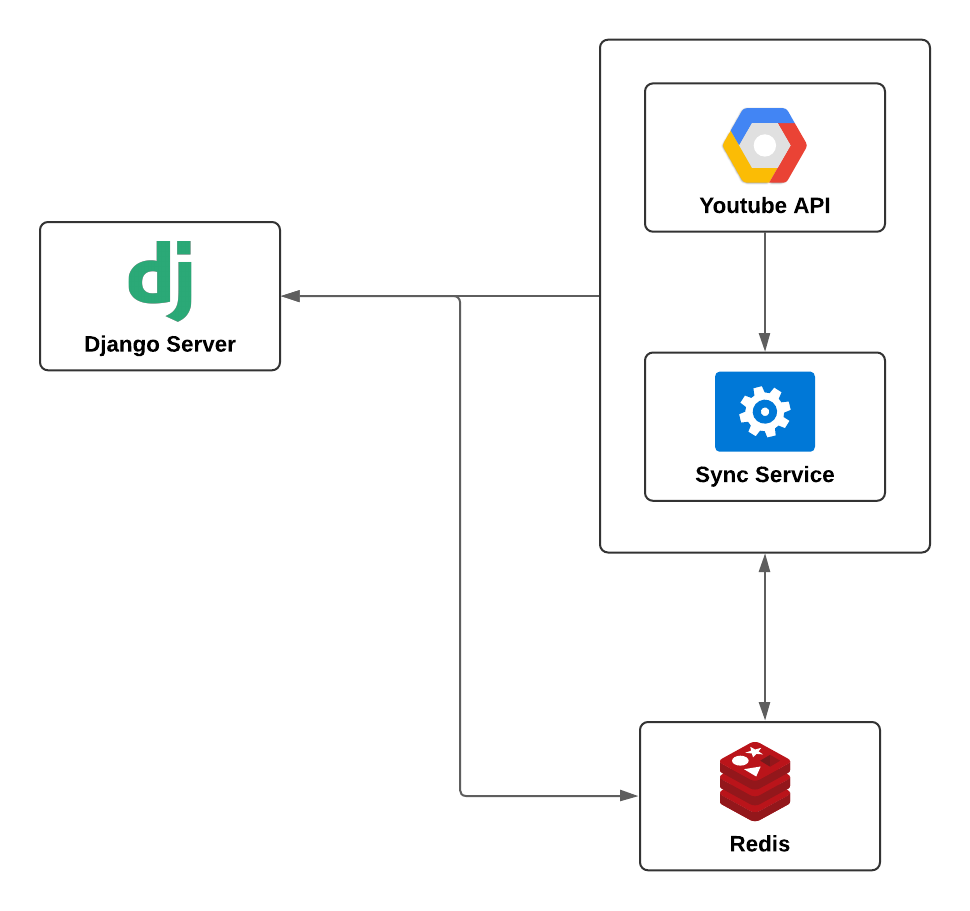

# youtube-video-list
[](https://www.codefactor.io/repository/github/pratikdaigavane/youtube-video-list)
[](https://github.com/PICT-ACM-Student-Chapter/OJ_API/actions)

API to fetch latest videos sorted in reverse chronological order of their publishing date-time from YouTube for a given tag/search query in a paginated response.

<p align=center>
    
    
</p>


## Features
 - Django Server used to build REST API
 - PEP-8 Coding guidelines followed
 - Containerized using Docker and managed using Docker Compose
 - API Documentation using swagger
 -  Asynchronous Service for fetching videos from Youtube using Celery
  - Admin Dashboard to view all videos in Database
  - Github Action for linting and building docker image
  - Redis used as messaging broker and in-memory cache
   - APIs built using Django Rest Framework

## System Architecture
<p align="center">

</p>


## Prerequisites

This project is built on top of docker containers. So ensure that you have
Docker and Docker Compose installed on your system For installation
instructions refer: https://docs.docker.com/install/

## Running linter

* Flake8 is used as primary linter for the project

To run test cases:

```sh
docker-compose run app sh -c "flake8"
```
## Starting the Server

Start Redis first:
```sh
docker-compose up -d redis
```
Then start whole project:
```
docker-compose up
```

## Details of the Project
 - As soon as server starts, the synchronization service starts fetching videos in a fixed interval. The interval can be configured through `.env.sample` file.
  - The API to list videos will available at `http://127.0.0.1:8000`. This API is paginated and has `previous` and `next` url field.
  - The API documentation can be accessed at `http://127.0.0.1:8000/swagger`
   - Default credentials to the admin panel are `username: admin` and `password: admin` and will be available at `http://127.0.0.1:8000/admin`
   - API keys can be added using admin panel
   - The video dashboard will be available at `http://127.0.0.1:8000/admin/video/video/`

